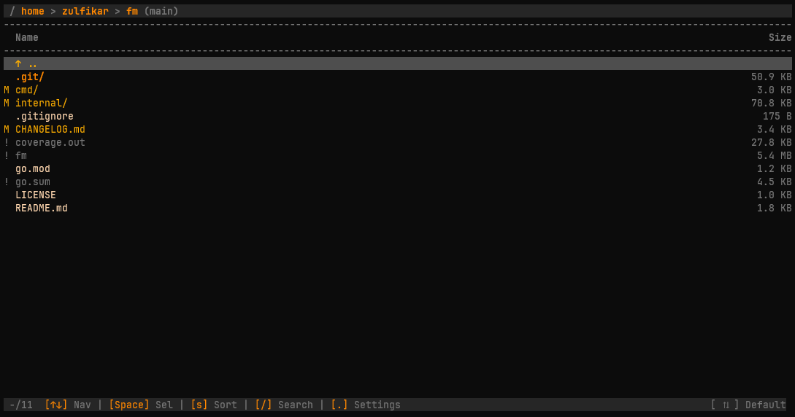

# FM - Terminal File Manager



A fast, modular, and feature-rich TUI file manager written in Go.

[](https://github.com/zulfikawr/fm/releases)
[](https://go.dev)
[](https://opensource.org/licenses/MIT)

## Features

- **🚀 Performance:** Fast navigation with a modular concurrent architecture, real-time file watching, and efficient git integration.
- **📁 File Operations:** Full CRUD with cut/paste, interactive conflict resolution, and trash support.
- **📦 Compression:** Zip selected files/directories and extract archives directly within the UI.
- **🛡️ Conflict Management:** Robust handling of file collisions with Overwrite, Skip, and Auto-rename policies.
- **🔒 Security:** Secure SSH host key verification, ZipSlip protection, and read-only filesystem protection.
- **☁️ Remote Access:** Connect to remote servers via SSH/SFTP with password or PEM key auth.
- **🌿 Git Integration:** Visual status markers (`M`, `A`, `D`, `?`) and current branch display.
- **🎨 Theme System:** Multiple color schemes including Nord, Dracula, and Gruvbox.
- **🔍 Search & Filter:** Real-time fuzzy-style filtering within directories.
- **🔎 Fuzzy Content Search:** Deep content search (`Alt+/`) across all files in a directory using a high-performance concurrent engine.
- **📜 Operation Logs:** Full history of all background operations (`Alt+L`) with real-time status tracking.
- **⚙️ Persistent Config:** Settings saved automatically to `~/.config/fm/config.json`.
- **💾 Memory:** Remembers your cursor and scroll position for every directory visited.
- **📑 Tabs:** Multitasking support with up to 9 active directory tabs.

## Keybindings

| Key | Action |
| --- | --- |
| `Enter` / `→` / `l` | Open directory / Open file in editor |
| `Backspace` / `←` / `h` | Navigate to parent directory |
| `Space` | Toggle selection for bulk actions |
| `Alt+T` | New tab (max 9) |
| `Alt+1`-`9` | Switch between tabs |
| `Alt+W` | Close current tab |
| `Alt+/` | Fuzzy content search (Find in Files) |
| `Alt+C` | View clipboard contents |
| `Alt+L` | View operation logs |
| `/` | Enter search/filter mode |
| `s` | Cycle sort modes (Name, Size, Date) |
| `c` | Copy selection to clipboard |
| `x` | Cut selection to clipboard |
| `v` | Paste clipboard contents |
| `r` | Rename highlighted item |
| `z` | Zip selected items |
| `u` | Unzip selected item |
| `d` | Trash selection (with confirmation) |
| `g` | Go to path (Local or Remote) |
| `.` | Toggle settings |
| `Esc` | Back / Clear selection |
| `Ctrl+C` | Quit |

## Installation

```bash
# Build from source
go build -o fm ./cmd/fm

# Run
./fm [path]
```

## Fuzzy Content Search (Find in Files)

Powered by a concurrent worker-pool engine, `fm` can search through file contents with high efficiency. 
- **Respects Git:** Automatically skips files ignored by `.gitignore`.
- **Intelligent Skipping:** Skips binary files and hidden folders (like `.git`) by default.
- **Expandable Results:** Grouped by file, toggle results with `Tab`.
- **Open at Line:** Press `Enter` on any search result to open your editor at the exact line number.

## Remote Access (SSH/SFTP)

Connect directly to remote servers using the `--remote` (or `-r`) flag or the in-app `g` (Go to) command. Supports SSH config aliases, SSH agent, identity files, and password authentication.

```bash
# Connect using an alias from ~/.ssh/config
fm -r my-server

# Connect using SSH agent or keys in default locations
fm --remote user@192.168.1.50

# Connect using a specific identity file (.pem, etc.)
fm -r user@40.82.128.117 ./path/to/key.pem
```

### Smart Path Detection (Poly-mode)
The `g` (Go to) command intelligently handles different input types:
- **Local:** Paths like `/var/log`, `~/Documents`, or `./src`.
- **Remote:** `user@host` or `host` (SFTP connection).
- **Aliases:** Hostnames defined in your `~/.ssh/config`.

Features interactive host key verification—if a host is unknown, `fm` will prompt you to verify the fingerprint and automatically add it to your `~/.ssh/known_hosts` upon confirmation.

## Configuration

Settings are stored in `~/.config/fm/config.json`. Key options include:

- **General:** `show_hidden`, `case_sensitive`, `wrap_navigation`
- **Display:** `show_size`, `show_date_modified`, `show_header`
- **Behavior:** `confirm_operations`, `enable_git`, `use_trash`
- **Preferences:** `theme_index`, `editor_index` (vim, nano, code, etc.)
- **Formats:** `date_format_index`, `size_format_index`

## License

This project is licensed under the MIT License - see the [LICENSE](LICENSE) file for details.